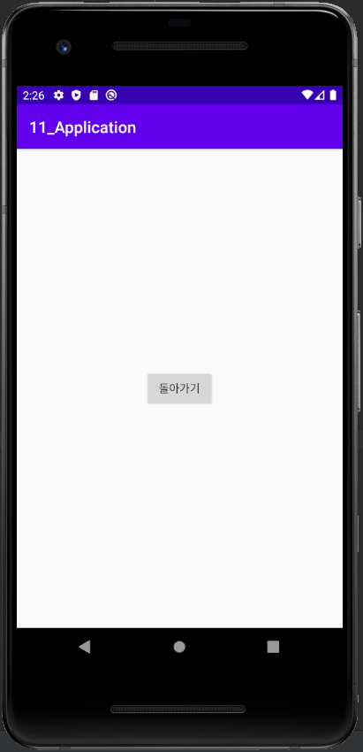

# MyFirstRepository

Hello my name is Juyeon

# 2주차 과제

</img>

# 3주차 과제

</img>
</img>
</img>

# 4주차 과제

아이디어 명 : 모바일 쇼핑몰 앱
- 디자이너 브랜드 ‘O!Oi’의 전용 모바일 쇼핑 앱
- 어플 내 배너를 통한 신상품, 인기 상품 등의 정보 제공
- 제품 유형별 탐색이 가능한 카테고리 제공
- 리뷰게시판을 개설하여 소비자의 알 권리 충족
- 콜라보, 시즌별 컬렉션들을 볼 수 있는 ‘LOOK BOOK’ 페이지 제공
- 사용자들과의 소통을 위한 공지사항, 이벤트 등을 제공하는 게시판 제공
- 오프라인 매장 이용을 원하는 소비자들을 위한 위치 제공 서비스

# 7주차 과제

</img>
</img>

# 9주차 과제

</img>
</img>
</img>
</img>
</img>
</img>

# 10주차 과제

</img>

# 11주차 과제

</img>
</img>
</img>
